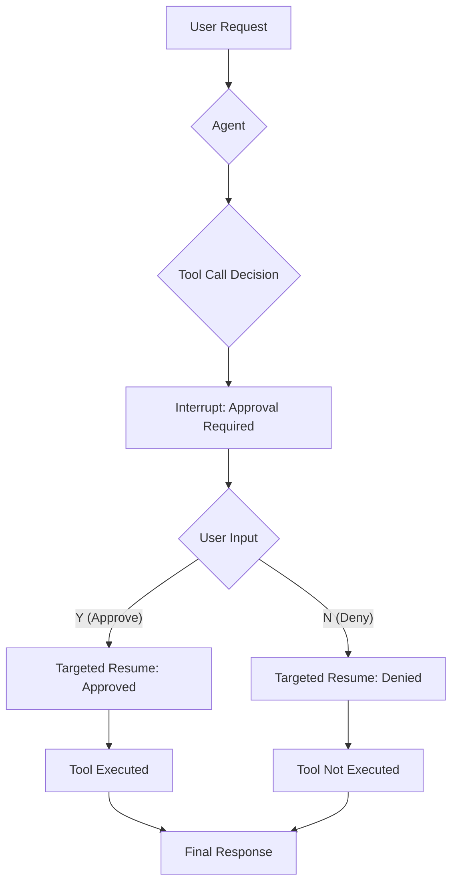

# Human-in-the-Loop: Approval Pattern

This example demonstrates a fundamental "human-in-the-loop" pattern: **Approval**.

It showcases how to build an agent that attempts to perform a sensitive action, pauses to request explicit user confirmation, and only proceeds after receiving approval.

## How It Works

1.  **Approvable Tool**: The agent is given a special tool (`BookTicket`) that is wrapped in an `InvokableApprovableTool`. This wrapper ensures that before the tool's function is executed, the agent must first get permission.

2.  **Agent Interrupt**: When the agent decides to use the `BookTicket` tool, the framework doesn't execute it. Instead, it triggers an **interrupt**. The agent's execution is paused, and an `InterruptInfo` object is sent back to the main application loop. This object contains details about the action that requires approval, such as the tool name and the parameters the agent intends to use.

3.  **User Confirmation**: The `main.go` logic catches this interrupt and prints the details of the pending action to the console. It then prompts the user to input "Y" (Yes) or "N" (No).

4.  **Targeted Resume**:
    *   If the user approves, the application calls `runner.ResumeWithParams`, sending back the approval. The framework then unpauses the agent, which proceeds to execute the `BookTicket` tool.
    *   If the user denies, the agent is also resumed, but it is informed of the denial, and it will not execute the tool.

## Practical Example

Here's a real trace from running the example, showing how the approval process works:

```
name: TicketBooker
path: [{TicketBooker}]
tool name: BookTicket
arguments: {"location":"Beijing","passenger_name":"Martin","passenger_phone_number":"1234567"}

name: TicketBooker
path: [{TicketBooker}]
tool 'BookTicket' interrupted with arguments '{"location":"Beijing","passenger_name":"Martin","passenger_phone_number":"1234567"}', waiting for your approval, please answer with Y/N

your input here: Y

name: TicketBooker
path: [{TicketBooker}]
tool response: success

name: TicketBooker
path: [{TicketBooker}]
answer: The ticket for Martin to Beijing on 2025-12-01 has been successfully booked.
```

This trace demonstrates:
- **Tool Identification**: The agent identifies the `BookTicket` tool with specific parameters
- **Approval Request**: The framework interrupts and presents the tool call for human approval
- **Human Decision**: The user approves with "Y"
- **Tool Execution**: The tool executes successfully
- **Final Response**: The agent provides a confirmation message

The path notation shows the simple agent structure for this single-agent approval workflow.

## How to Configure Environment Variables

Before running the example, you need to set up the required environment variables for the LLM API. You have two options:

### Option 1: OpenAI-Compatible Configuration
```bash
export OPENAI_API_KEY="{your api key}"
export OPENAI_BASE_URL="{your model base url}"
# Only configure this if you are using Azure-like LLM providers
export OPENAI_BY_AZURE=true
# 'gpt-4o' is just an example, configure the model name provided by your LLM provider
export OPENAI_MODEL="gpt-4o-2024-05-13"
```

### Option 2: ARK Configuration
```bash
export MODEL_TYPE="ark"
export ARK_API_KEY="{your ark api key}"
export ARK_MODEL="{your ark model name}"
```

Alternatively, you can create a `.env` file in the project root with these variables.

## How to Run

Ensure you have your environment variables set (e.g., for the LLM API key). Then, run the following command from the root of the `eino-examples` repository:

```sh
go run ./adk/human-in-the-loop/1_approval
```

You will see the agent's reasoning, followed by a prompt asking for your approval to book the ticket. Enter `Y` to see the agent complete the action.

## Workflow Diagram

