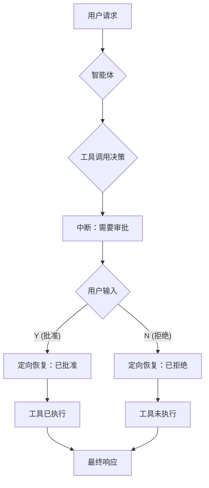

# 人机协同：审批模式

本示例演示了一个基础的"人机协同"模式：**审批**。

它展示了如何构建一个智能体，该智能体在执行敏感操作前会暂停，请求用户的明确确认，只有在获得批准后才继续执行。

## 工作原理

1.  **可审批工具**：智能体被赋予一个特殊的工具（`BookTicket`），该工具被包装在 `InvokableApprovableTool` 中。此包装器确保在执行工具功能之前，智能体必须首先获得权限。

2.  **智能体中断**：当智能体决定使用 `BookTicket` 工具时，框架不会立即执行它，而是触发一个**中断**。智能体的执行被暂停，一个 `InterruptInfo` 对象被发送回主应用程序循环。该对象包含需要审批的操作详情，例如工具名称和智能体打算使用的参数。

3.  **用户确认**：`main.go` 中的逻辑捕获此中断，并将待处理操作的详细信息打印到控制台。然后提示用户输入 "Y"（是）或 "N"（否）。

4.  **定向恢复**：
    *   如果用户批准，应用程序调用 `runner.ResumeWithParams`，发送回批准信息。框架随后恢复智能体的执行，智能体继续执行 `BookTicket` 工具。
    *   如果用户拒绝，智能体也会被恢复，但会收到拒绝通知，并且不会执行该工具。

## 实际示例

以下是运行示例的实际跟踪记录，展示了审批流程的工作原理：

```
name: TicketBooker
path: [{TicketBooker}]
tool name: BookTicket
arguments: {"location":"Beijing","passenger_name":"Martin","passenger_phone_number":"1234567"}

name: TicketBooker
path: [{TicketBooker}]
tool 'BookTicket' interrupted with arguments '{"location":"Beijing","passenger_name":"Martin","passenger_phone_number":"1234567"}', waiting for your approval, please answer with Y/N

your input here: Y

name: TicketBooker
path: [{TicketBooker}]
tool response: success

name: TicketBooker
path: [{TicketBooker}]
answer: The ticket for Martin to Beijing on 2025-12-01 has been successfully booked.
```

此跟踪记录展示了：
- **工具识别**：智能体识别出 `BookTicket` 工具及其具体参数
- **审批请求**：框架中断执行并向用户呈现待审批的工具调用
- **用户决策**：用户输入 "Y" 表示批准
- **工具执行**：工具成功执行
- **最终响应**：智能体提供确认消息

路径表示法展示了这个单智能体审批工作流的简单结构。

## 如何配置环境变量

在运行示例之前，您需要设置 LLM API 所需的环境变量。您有两个选项：

### 选项 1: OpenAI 兼容配置
```bash
export OPENAI_API_KEY="{your api key}"
export OPENAI_BASE_URL="{your model base url}"
# 仅在使用 Azure 类 LLM 提供商时配置此项
export OPENAI_BY_AZURE=true
# 'gpt-4o' 只是一个示例，请配置您的 LLM 提供商提供的实际模型名称
export OPENAI_MODEL="gpt-4o-2024-05-13"
```

### 选项 2: ARK 配置
```bash
export MODEL_TYPE="ark"
export ARK_API_KEY="{your ark api key}"
export ARK_MODEL="{your ark model name}"
```

或者，您可以在项目根目录创建一个 `.env` 文件来设置这些变量。

## 如何运行

确保您已设置好环境变量（例如，LLM API 密钥）。然后，在 `eino-examples` 仓库的根目录下运行以下命令：

```sh
go run ./adk/human-in-the-loop/1_approval
```

您将看到智能体的推理过程，随后是一个提示，询问您是否批准订票。输入 `Y` 可查看智能体完成操作。

## 工作流程图

