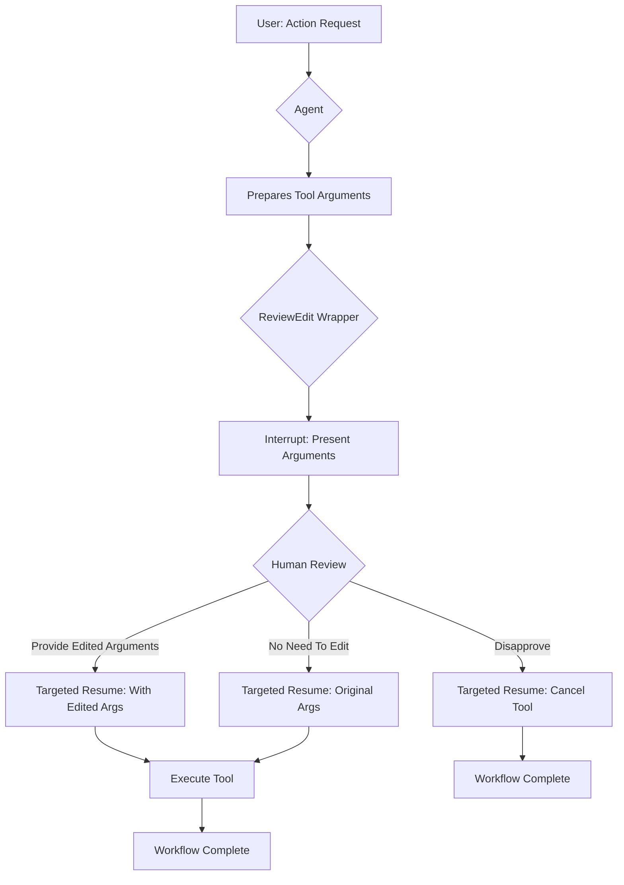

# Human-in-the-Loop: Review-and-Edit Pattern

This example demonstrates a sophisticated "human-in-the-loop" pattern: **Review-and-Edit**. It showcases a workflow where an agent's tool calls are intercepted for human review, allowing the user to edit the arguments before execution, approve them as-is, or disapprove the tool call entirely.

## How It Works

This implementation uses a **tool wrapper architecture** that intercepts tool calls and presents them to the user for review:

1. **Agent Tool Call**: The agent identifies a tool to call based on the user's request
2. **Interrupt for Review**: The `InvokableReviewEditTool` wrapper intercepts the call and presents the arguments to the user
3. **Human Review**: The user can:
   - **Edit the arguments**: Provide corrected JSON arguments
   - **Approve as-is**: Type "no need to edit" to proceed with original arguments
   - **Disapprove**: Type "disapprove" to cancel the tool call, optionally providing a reason
4. **Resume Execution**: The system resumes with the user's decision

### Workflow Sequence

1. **Initial Request**: User requests an action (e.g., "Book a ticket to Beijing for Martin")
2. **Tool Identification**: Agent identifies the appropriate tool and prepares arguments
3. **Review Interrupt**: System interrupts and presents arguments for human review
4. **Human Decision**: User provides edited arguments, approval, or disapproval
5. **Execution**: System executes the tool with the final arguments (or cancels if disapproved)

## Key Features Demonstrated

- **Argument-Level Control**: Fine-grained control over tool call parameters
- **Error Correction**: Ability to fix incorrect or incomplete arguments before execution
- **Safety Mechanism**: Option to disapprove potentially harmful or incorrect tool calls
- **Transparent Execution**: Full visibility into what the agent is about to execute

## How to Configure Environment Variables

Before running the example, you need to set up the required environment variables for the LLM API. You have two options:

### Option 1: OpenAI-Compatible Configuration
```bash
export OPENAI_API_KEY="{your api key}"
export OPENAI_BASE_URL="{your model base url}"
# Only configure this if you are using Azure-like LLM providers
export OPENAI_BY_AZURE=true
# 'gpt-4o' is just an example, configure the model name provided by your LLM provider
export OPENAI_MODEL="gpt-4o-2024-05-13"
```

### Option 2: ARK Configuration
```bash
export MODEL_TYPE="ark"
export ARK_API_KEY="{your ark api key}"
export ARK_MODEL="{your ark model name}"
```

Alternatively, you can create a `.env` file in the project root with these variables.

## How to Run

Ensure you have your environment variables set (e.g., for the LLM API key). Then, run the following command from the root of the `eino-examples` repository:

```sh
go run ./adk/human-in-the-loop/2_review-and-edit
```

You will see:
1. The agent processing your request and identifying the appropriate tool
2. A prompt showing the tool arguments and asking for your review
3. Options to provide edited arguments, approve as-is, or disapprove
4. The system executing the tool with your final decision

## Workflow Diagram



## Practical Example

Here's a real trace from running the example, showing how the review-and-edit process works:

```
name: TicketBooker
path: [{TicketBooker}]
tool name: BookTicket
arguments: {"location":"Beijing","passenger_name":"Martin","passenger_phone_number":"1234567"}

name: TicketBooker
path: [{TicketBooker}]
Tool 'BookTicket' is about to be called with the following arguments:
`
{"location":"Beijing","passenger_name":"Martin","passenger_phone_number":"1234567"}
`

Please review and either provide edited arguments in JSON format, reply with 'no need to edit', or reply with 'N' to disapprove the tool call.


Your input: {"location":"Beijing","passenger_name":"Martin","passenger_phone_number":"1234568"}

name: TicketBooker
path: [{TicketBooker}]
tool response: success

name: TicketBooker
path: [{TicketBooker}]
answer: The ticket for Martin to Beijing on 2025-12-01 has been successfully booked. If you need any more assistance, feel free to ask!
```

This trace demonstrates:
- **Initial tool preparation**: The agent prepares to call the BookTicket tool with the extracted parameters
- **Human review**: The system interrupts and presents the arguments for review
- **Argument correction**: The user notices a typo in the phone number (1234567 → 1234568) and provides corrected arguments
- **Successful execution**: The tool executes with the corrected arguments and confirms the booking

## Implementation Details

### Tool Wrapper Architecture
- **InvokableReviewEditTool**: Custom wrapper implementing the `tool.InvokableTool` interface
- **ReviewEditInfo**: Struct that maintains the tool name, arguments, and review result
- **ReviewEditResult**: Struct that captures the user's decision (edited args, approval, or disapproval)

### State Management
- The wrapper uses `compose.StatefulInterrupt()` to pause execution while preserving state
- Implements `Resume()` method to handle different user decision scenarios
- Maintains tool call context through the interrupt/resume cycle

### User Interaction
- Presents arguments in a clear, JSON-formatted manner
- Provides clear instructions for different response options
- Handles both successful execution and cancellation scenarios gracefully

## Use Cases

This pattern is ideal for:
- **Critical Operations**: Actions where incorrect parameters could have serious consequences
- **Data Validation**: Ensuring data quality before execution
- **Security Controls**: Reviewing potentially sensitive operations
- **Quality Assurance**: Catching and correcting agent errors before they execute
- **Training Scenarios**: Teaching agents by correcting their parameter choices

## Comparison with Other Patterns

- **vs. Approval Pattern**: Review-and-edit provides argument-level control, while approval only allows approve/deny decisions
- **vs. Feedback Loop**: Review-and-edit focuses on pre-execution correction, while feedback loop handles post-execution refinement
- **vs. Follow-up**: Review-and-edit is proactive (before execution), while follow-up is reactive (after execution)

This implementation demonstrates how sophisticated human-in-the-loop workflows can provide precise control over agent behavior while maintaining the efficiency of automated execution.