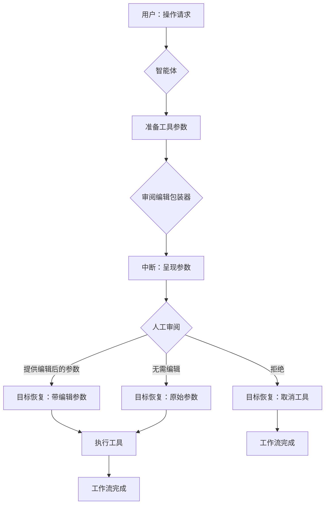

# 人机协同：审阅与编辑模式

本示例演示了一个复杂的"人机协同"模式：**审阅与编辑**。它展示了一个工作流，其中智能体的工具调用会被拦截以供人工审阅，允许用户在执行前编辑参数、按原样批准或完全拒绝工具调用。

## 工作原理

此实现使用**工具包装器架构**，拦截工具调用并将其呈现给用户进行审阅：

1. **智能体工具调用**：智能体根据用户请求识别要调用的工具
2. **审阅中断**：`InvokableReviewEditTool` 包装器拦截调用并将参数呈现给用户
3. **人工审阅**：用户可以：
   - **编辑参数**：提供修正后的 JSON 参数
   - **按原样批准**：输入"无需编辑"以使用原始参数继续执行
   - **拒绝**：输入"拒绝"以取消工具调用，可选择提供原因
4. **恢复执行**：系统根据用户的决定恢复执行

### 工作流序列

1. **初始请求**：用户请求操作（例如，"为 Martin 预订到北京的机票"）
2. **工具识别**：智能体识别适当的工具并准备参数
3. **审阅中断**：系统中断并呈现参数供人工审阅
4. **人工决策**：用户提供编辑后的参数、批准或拒绝
5. **执行**：系统使用最终参数执行工具（如果被拒绝则取消）

## 展示的关键特性

- **参数级控制**：对工具调用参数的精细控制
- **错误修正**：在执行前修正不正确或不完整的参数
- **安全机制**：拒绝可能有害或不正确的工具调用
- **透明执行**：完全可见智能体即将执行的内容

## 如何配置环境变量

在运行示例之前，您需要设置 LLM API 所需的环境变量。您有两个选项：

### 选项 1: OpenAI 兼容配置
```bash
export OPENAI_API_KEY="{your api key}"
export OPENAI_BASE_URL="{your model base url}"
# 仅在使用 Azure 类 LLM 提供商时配置此项
export OPENAI_BY_AZURE=true
# 'gpt-4o' 只是一个示例，请配置您的 LLM 提供商提供的实际模型名称
export OPENAI_MODEL="gpt-4o-2024-05-13"
```

### 选项 2: ARK 配置
```bash
export MODEL_TYPE="ark"
export ARK_API_KEY="{your ark api key}"
export ARK_MODEL="{your ark model name}"
```

或者，您可以在项目根目录创建一个 `.env` 文件来设置这些变量。

## 如何运行

确保您已设置好环境变量（例如，LLM API 密钥）。然后，在 `eino-examples` 仓库的根目录下运行以下命令：

```sh
go run ./adk/human-in-the-loop/2_review-and-edit
```

您将看到：
1. 智能体处理您的请求并识别适当的工具
2. 提示显示工具参数并要求您审阅
3. 选项提供编辑后的参数、按原样批准或拒绝
4. 系统根据您的最终决定执行工具

## 工作流程图



## 实际示例

以下是运行示例的实际跟踪记录，展示了审阅与编辑过程的工作原理：

```
name: TicketBooker
path: [{TicketBooker}]
tool name: BookTicket
arguments: {"location":"Beijing","passenger_name":"Martin","passenger_phone_number":"1234567"}

name: TicketBooker
path: [{TicketBooker}]
Tool 'BookTicket' is about to be called with the following arguments:
`
{"location":"Beijing","passenger_name":"Martin","passenger_phone_number":"1234567"}
`

Please review and either provide edited arguments in JSON format, reply with 'no need to edit', or reply with 'N' to disapprove the tool call.


Your input: {"location":"Beijing","passenger_name":"Martin","passenger_phone_number":"1234568"}

name: TicketBooker
path: [{TicketBooker}]
tool response: success

name: TicketBooker
path: [{TicketBooker}]
answer: The ticket for Martin to Beijing on 2025-12-01 has been successfully booked. If you need any more assistance, feel free to ask!
```

此跟踪记录展示了：
- **初始工具准备**：智能体准备调用 BookTicket 工具并提取参数
- **人工审阅**：系统中断并呈现参数供审阅
- **参数修正**：用户注意到电话号码中的拼写错误（1234567 → 1234568）并提供修正后的参数
- **成功执行**：工具使用修正后的参数执行并确认预订

## 实现细节

### 工具包装器架构
- **InvokableReviewEditTool**：实现 `tool.InvokableTool` 接口的自定义包装器
- **ReviewEditInfo**：维护工具名称、参数和审阅结果的结构
- **ReviewEditResult**：捕获用户决策（编辑后的参数、批准或拒绝）的结构

### 状态管理
- 包装器使用 `compose.StatefulInterrupt()` 暂停执行同时保留状态
- 实现 `Resume()` 方法来处理不同的用户决策场景
- 通过中断/恢复周期维护工具调用上下文

### 用户交互
- 以清晰、JSON 格式化的方式呈现参数
- 为不同的响应选项提供清晰的说明
- 优雅地处理成功执行和取消场景

## 使用场景

此模式非常适用于：
- **关键操作**：参数不正确可能产生严重后果的操作
- **数据验证**：在执行前确保数据质量
- **安全控制**：审阅可能敏感的操作
- **质量保证**：在执行前捕获并修正智能体错误
- **训练场景**：通过修正参数选择来训练智能体

## 与其他模式的比较

- **与批准模式**：审阅与编辑提供参数级控制，而批准仅允许批准/拒绝决策
- **与反馈循环**：审阅与编辑专注于执行前修正，而反馈循环处理执行后优化
- **与跟进模式**：审阅与编辑是主动的（执行前），而跟进是被动的（执行后）

该实现展示了复杂的人机协同工作流如何在保持自动化执行效率的同时，提供对智能体行为的精确控制。