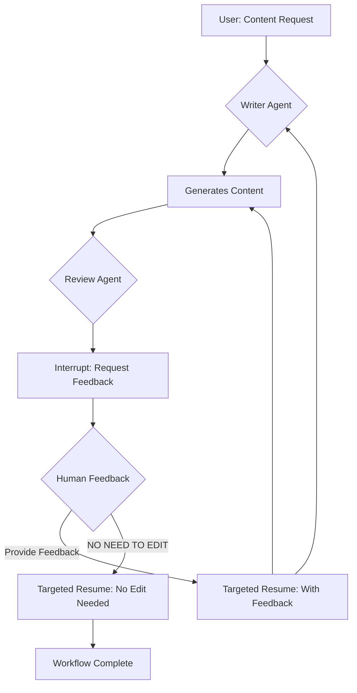

# Human-in-the-Loop: Feedback Loop Pattern

This example demonstrates a sophisticated "human-in-the-loop" pattern: **Feedback Loop**. It showcases a multi-agent workflow where one agent generates content, another agent requests human feedback, and the system supports iterative refinement based on that feedback.

## How It Works

This implementation uses a **multi-agent architecture** with two specialized agents working together:

1. **Writer Agent**: A specialized agent that generates creative content (poems in this example). It produces the initial draft and can incorporate feedback to create revised versions.

2. **Review Agent**: An agent that acts as a bridge between the Writer Agent and the human reviewer. It:
   - Captures the content generated by the Writer Agent
   - Triggers an interrupt to request human feedback
   - Handles the resume process with human feedback
   - Either passes the feedback to the Writer Agent or exits the loop if no edits are needed

### Workflow Sequence

1. **Initial Request**: The user requests content creation (e.g., "write a short poem about potato")
2. **Content Generation**: The Writer Agent generates the initial content
3. **Feedback Interrupt**: The Review Agent captures the content and triggers an interrupt, presenting it to the human for feedback
4. **Human Feedback**: The human can either:
   - Provide specific feedback for improvements
   - Indicate "NO NEED TO EDIT" if the content is satisfactory
5. **Resume and Iterate**: The system resumes with the human's feedback:
   - If feedback is provided, the Writer Agent generates a revised version
   - If "NO NEED TO EDIT" is selected, the workflow completes
6. **Loop Continuation**: The process can repeat for multiple iterations of feedback and refinement

## Key Features Demonstrated

- **Multi-Agent Collaboration**: Shows how different agents can work together in a coordinated workflow
- **Stateful Interrupts**: The Review Agent maintains state about the content being reviewed
- **Iterative Refinement**: Supports multiple rounds of human feedback and content improvement
- **Flexible Exit Conditions**: Allows the human to indicate when the content is satisfactory

## How to Configure Environment Variables

Before running the example, you need to set up the required environment variables for the LLM API. You have two options:

### Option 1: OpenAI-Compatible Configuration
```bash
export OPENAI_API_KEY="{your api key}"
export OPENAI_BASE_URL="{your model base url}"
# Only configure this if you are using Azure-like LLM providers
export OPENAI_BY_AZURE=true
# 'gpt-4o' is just an example, configure the model name provided by your LLM provider
export OPENAI_MODEL="gpt-4o-2024-05-13"
```

### Option 2: ARK Configuration
```bash
export MODEL_TYPE="ark"
export ARK_API_KEY="{your ark api key}"
export ARK_MODEL="{your ark model name}"
```

Alternatively, you can create a `.env` file in the project root with these variables.

## How to Run

Ensure you have your environment variables set (e.g., for the LLM API key). Then, run the following command from the root of the `eino-examples` repository:

```sh
go run ./adk/human-in-the-loop/3_feedback-loop
```

You will see:
1. The Writer Agent generating a poem about potatoes
2. A prompt asking for your feedback
3. Options to either provide specific feedback or type "NO NEED TO EDIT"
4. The system incorporating your feedback and generating revised content

## Workflow Diagram



## Practical Example

Here's a real trace from running the example, showing how the iterative feedback process works:

```
name: WriterAgent
path: [{Writer MultiAgent} {WriterAgent}]
answer: Hidden beneath earth's gentle fold,
A humble potato, golden and bold.

name: ReviewerAgent
path: [{Writer Multi-Agent} {WriterAgent} {ReviewerAgent}]
Original content to review:
`
Hidden beneath earth's gentle fold,
A humble potato, golden and bold.
`.
If you think the content is good as it is, please reply with "No need to edit".
Otherwise, please provide your feedback.

your input here: Make it more funny.

name: ReviewerAgent
path: [{Writer Multi-Agent} {WriterAgent} {ReviewerAgent}]
answer: Make it more funny.

name: WriterAgent
path: [{Writer Multi-Agent} {WriterAgent} {ReviewerAgent} {WriterAgent}]
answer: I'm just a spud, not a fancy tomato,
But mash me up, I'm a party potato!

name: ReviewerAgent
path: [{Writer Multi-Agent} {WriterAgent} {ReviewerAgent} {WriterAgent} {ReviewerAgent}]
Original content to review:
`
I'm just a spud, not a fancy tomato,
But mash me up, I'm a party potato!
`.
If you think the content is good as it is, please reply with "No need to edit".
Otherwise, please provide your feedback.

your input here: No need to edit

name: ReviewerAgent
path: [{Writer Multi-Agent} {WriterAgent} {ReviewerAgent} {WriterAgent} {ReviewerAgent}]
action: exit
```

This trace demonstrates:
- **Initial generation**: The Writer Agent creates a serious poem about potatoes
- **Human feedback**: The user requests a more humorous tone
- **Iterative improvement**: The Writer Agent incorporates the feedback and creates a funnier version
- **Workflow completion**: The user approves the revised version, ending the process

The path notation shows the hierarchical agent structure and how the workflow progresses through multiple iterations.

## Implementation Details

### Agent Architecture
- **WriterAgent**: Uses `adk.NewChatModelAgent` with specific instructions for poem writing
- **ReviewAgent**: Custom agent implementing the `adk.Agent` interface with interrupt/resume logic
- **LoopAgent**: Wraps both agents using `adk.NewLoopAgent` to create the multi-agent workflow

### State Management
- The `FeedbackInfo` struct maintains:
  - `OriginalContent`: The content being reviewed
  - `Feedback`: Human feedback for improvements
  - `NoNeedToEdit`: Flag indicating content is satisfactory

### Interrupt/Resume Logic
- Uses `adk.StatefulInterrupt()` to pause execution and request human input while preserving state
- Implements `Resume()` method to handle different resume scenarios
- Supports both feedback-based iteration and workflow completion

## Use Cases

This pattern is ideal for:
- Content creation and refinement (writing, design, code generation)
- Quality assurance workflows
- Collaborative editing processes
- Any scenario requiring human judgment and iterative improvement

The implementation demonstrates how complex human-in-the-loop workflows can be built using the Eino framework's interrupt and resume capabilities.