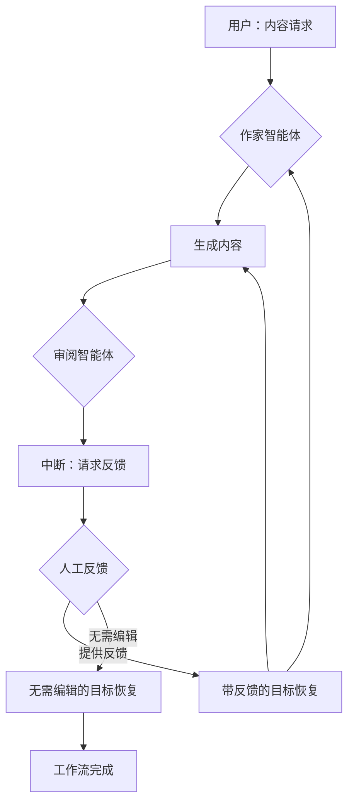

# 人机协同：反馈循环模式

本示例演示了一个复杂的"人机协同"模式：**反馈循环**。它展示了一个多智能体工作流，其中一个智能体生成内容，另一个智能体请求人工反馈，系统支持基于人工反馈的迭代优化。

## 工作原理

此实现使用**多智能体架构**，两个专业智能体协同工作：

1. **作家智能体**：一个专门生成创意内容（本例中为诗歌）的智能体。它生成初稿，并能根据反馈进行修改。

2. **审阅智能体**：一个在作家智能体和人工审阅者之间充当桥梁的智能体。它：
   - 捕获作家智能体生成的内容
   - 触发中断以请求人工反馈
   - 处理带有人工反馈的恢复过程
   - 将反馈传递给作家智能体，或在无需编辑时退出循环

### 工作流序列

1. **初始请求**：用户请求内容创作（例如，"写一首关于土豆的短诗"）
2. **内容生成**：作家智能体生成初始内容
3. **反馈中断**：审阅智能体捕获内容并触发中断，呈现给人工以供反馈
4. **人工反馈**：人工可以：
   - 提供具体的改进建议
   - 如果内容令人满意，则指示"无需编辑"
5. **恢复与迭代**：系统根据人工反馈恢复：
   - 如果提供了反馈，作家智能体将生成修订版
   - 如果选择"无需编辑"，工作流完成
6. **循环继续**：此过程可以重复进行多轮反馈和优化

## 展示的关键特性

- **多智能体协作**：展示了不同智能体如何在协调的工作流中协同工作
- **有状态中断**：审阅智能体维护正在审阅内容的状态
- **迭代优化**：支持多轮人工反馈和内容改进
- **灵活退出条件**：允许人工指示内容何时令人满意

## 如何配置环境变量

在运行示例之前，您需要设置 LLM API 所需的环境变量。您有两个选项：

### 选项 1: OpenAI 兼容配置
```bash
export OPENAI_API_KEY="{your api key}"
export OPENAI_BASE_URL="{your model base url}"
# 仅在使用 Azure 类 LLM 提供商时配置此项
export OPENAI_BY_AZURE=true
# 'gpt-4o' 只是一个示例，请配置您的 LLM 提供商提供的实际模型名称
export OPENAI_MODEL="gpt-4o-2024-05-13"
```

### 选项 2: ARK 配置
```bash
export MODEL_TYPE="ark"
export ARK_API_KEY="{your ark api key}"
export ARK_MODEL="{your ark model name}"
```

或者，您可以在项目根目录创建一个 `.env` 文件来设置这些变量。

## 如何运行

确保您已设置好环境变量（例如，LLM API 密钥）。然后，在 `eino-examples` 仓库的根目录下运行以下命令：

```sh
go run ./adk/human-in-the-loop/3_feedback-loop
```

您将看到：
1. 作家智能体生成一首关于土豆的诗
2. 提示您提供反馈
3. 可选择提供具体反馈或输入"无需编辑"
4. 系统采纳您的反馈并生成修订内容

## 工作流程图



## 实际示例

以下是运行示例的实际跟踪记录，展示了迭代反馈过程的工作原理：

```
name: WriterAgent
path: [{Writer Multi-Agent} {WriterAgent}]
answer: Hidden beneath earth's gentle fold,
A humble potato, golden and bold.

name: ReviewerAgent
path: [{Writer Multi-Agent} {WriterAgent} {ReviewerAgent}]
Original content to review:
`
Hidden beneath earth's gentle fold,
A humble potato, golden and bold.
`.
If you think the content is good as it is, please reply with "No need to edit".
Otherwise, please provide your feedback.

your input here: Make it more funny.

name: ReviewerAgent
path: [{Writer Multi-Agent} {WriterAgent} {ReviewerAgent}]
answer: Make it more funny.

name: WriterAgent
path: [{Writer Multi-Agent} {WriterAgent} {ReviewerAgent} {WriterAgent}]
answer: I'm just a spud, not a fancy tomato,
But mash me up, I'm a party potato!

name: ReviewerAgent
path: [{Writer Multi-Agent} {WriterAgent} {ReviewerAgent} {WriterAgent} {ReviewerAgent}]
Original content to review:
`
I'm just a spud, not a fancy tomato,
But mash me up, I'm a party potato!
`.
If you think the content is good as it is, please reply with "No need to edit".
Otherwise, please provide your feedback.

your input here: No need to edit

name: ReviewerAgent
path: [{Writer Multi-Agent} {WriterAgent} {ReviewerAgent} {WriterAgent} {ReviewerAgent}]
action: exit
```

此跟踪记录展示了：
- **初始生成**：作家智能体创作了一首关于土豆的严肃诗歌
- **人工反馈**：用户要求更幽默的风格
- **迭代改进**：作家智能体采纳反馈并创作了更有趣的版本
- **工作流完成**：用户批准修订版，结束流程

路径表示法显示了分层智能体结构以及工作流如何通过多次迭代进行。

## 实现细节

### 智能体架构
- **WriterAgent**：使用 `adk.NewChatModelAgent` 并带有特定的诗歌创作指令
- **ReviewAgent**：实现 `adk.Agent` 接口的自定义智能体，具有中断/恢复逻辑
- **LoopAgent**：使用 `adk.NewLoopAgent` 包装两个智能体以创建多智能体工作流

### 状态管理
- `FeedbackInfo` 结构维护：
  - `OriginalContent`：正在审阅的内容
  - `Feedback`：用于改进的人工反馈
  - `NoNeedToEdit`：指示内容令人满意的标志

### 中断/恢复逻辑
- 使用 `adk.StatefulInterrupt()` 暂停执行并请求人工输入，同时保留状态
- 实现 `Resume()` 方法以处理不同的恢复场景
- 支持基于反馈的迭代和工作流完成

## 使用场景

此模式非常适用于：
- 内容创作和优化（写作、设计、代码生成）
- 质量保证工作流
- 协作编辑过程
- 任何需要人工判断和迭代改进的场景

该实现展示了如何使用 Eino 框架的中断和恢复功能构建复杂的人机协同工作流。