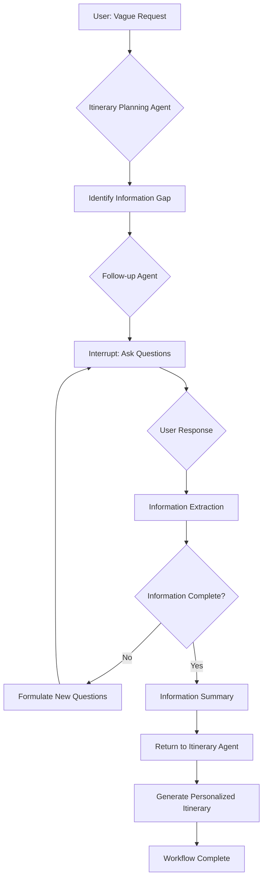

# Human-in-the-Loop: Follow-up Pattern

This example demonstrates an intelligent "human-in-the-loop" pattern: **Follow-up**. It showcases a multi-agent workflow where one agent (the itinerary planner) identifies missing information and delegates to another specialized follow-up agent to proactively and iteratively collect necessary information from the user, ultimately completing complex tasks.

## How It Works

This implementation uses a **nested agent architecture** with two specialized agents working together:

1. **Itinerary Planning Agent**: A specialized agent that generates travel itineraries. When it detects insufficient information in user requests (e.g., knowing the destination but not the interests), it calls the follow-up agent.

2. **Follow-up Agent**: A specialized agent responsible for information collection. It:
   - Uses the `FollowUpTool` to interrupt execution and ask the user questions
   - Analyzes user responses to extract required information
   - If information is incomplete, formulates new questions to continue the inquiry
   - Returns an information summary when exit conditions are met (complete information, user refusal, maximum attempts reached)

### Workflow Sequence

1. **Initial Request**: User makes a vague request (e.g., "Plan a 3-day trip to New York City")
2. **Information Recognition**: Itinerary planning agent identifies missing information and calls the follow-up agent
3. **Follow-up Interruption**: Follow-up agent triggers an interrupt, presenting formatted question lists to the user
4. **User Response**: User provides natural language answers
5. **Information Extraction & Iteration**: Follow-up agent:
   - Extracts required information from responses
   - If information is incomplete, creates new targeted questions
   - Repeats the follow-up process (up to 10 attempts)
6. **Information Summary**: When sufficient information is gathered or exit conditions are met, returns an information summary
7. **Task Completion**: Itinerary planning agent generates personalized itinerary based on collected information

## Key Features Demonstrated

- **Intelligent Information Recognition**: Agents can identify when more information is needed
- **Iterative Follow-up**: Supports multi-turn conversations, dynamically adjusting questions based on user responses
- **Information Extraction**: Extracts structured information from natural language responses
- **Exit Condition Management**: Gracefully handles incomplete information or user refusal
- **Nested Agent Collaboration**: Demonstrates how agents can delegate specialized tasks

## How to Configure Environment Variables

Before running the example, you need to set up the required environment variables for the LLM API. You have two options:

### Option 1: OpenAI-Compatible Configuration
```bash
export OPENAI_API_KEY="{your api key}"
export OPENAI_BASE_URL="{your model base url}"
# Only configure this if you are using Azure-like LLM providers
export OPENAI_BY_AZURE=true
# 'gpt-4o' is just an example, configure the model name provided by your LLM provider
export OPENAI_MODEL="gpt-4o-2024-05-13"
```

### Option 2: ARK Configuration
```bash
export MODEL_TYPE="ark"
export ARK_API_KEY="{your ark api key}"
export ARK_MODEL="{your ark model name}"
```

Alternatively, you can create a `.env` file in the project root with these variables.

## How to Run

Ensure you have set up your environment variables (e.g., LLM API keys). Then, run the following command from the root of the `eino-examples` repository:

```sh
go run ./adk/human-in-the-loop/4_follow-up
```

You will see:
1. Itinerary planning agent identifying information needs
2. Follow-up agent starting the questioning process
3. Multi-turn conversation with the agent
4. Final personalized itinerary based on your preferences

## Workflow Diagram



## Practical Example

Here's a real trace from running the example, showing how the follow-up process works:

```
name: ItineraryAgent 
path: [{ItineraryAgent}] 
tool name: FollowUpAgent 
arguments: {"request":"What are your interests or preferences for this 3-day trip to New York City? For example, do you like museums, theater, shopping, food experiences, outdoor activities, historical sites, or anything else specific?"} 

name: ItineraryAgent 
path: [{ItineraryAgent}] 
We need more information. Please answer the following questions: 
1. What are your interests or preferences for the 3-day trip to New York City? 
2. Do you prefer museums, theater, shopping, food experiences, outdoor activities, or historical sites? 
3. Are there any specific places or activities you want to include in your trip? 

Your answer: My main interest are family friendly theme parks. We prefer theaters at night. I don't have any particular places or activities in mind. 

name: ItineraryAgent 
path: [{ItineraryAgent}] 
We need more information. Please answer the following questions: 
1. Are you interested in visiting any of the well-known theme parks near New York City, such as Six Flags Great Adventure or Coney Island? 
2. What type of theater shows do you prefer at night? (e.g., musicals, Broadway shows, plays, comedy) 
3. Do you want recommendations for family-friendly restaurants or dining experiences? 

Your answer: I have no prior knowledge or New York City's theme parks, so help me decide. We prefer musicals. Chinese food will suffice. 

name: ItineraryAgent 
path: [{ItineraryAgent}] 
tool response: You are interested in family-friendly theme parks but do not have prior knowledge of the options near New York City. You prefer theatrical musicals for evening shows and are open to Chinese food for dining experiences. You don't have specific places or activities in mind and are seeking help to decide on theme parks to visit. 

name: ItineraryAgent 
path: [{ItineraryAgent}] 
answer: Here's a suggested 3-day itinerary for your family-friendly trip to New York City, including theme parks, theatrical musicals, and Chinese dining experiences: 

Day 1: 
- Morning: Visit Luna Park at Coney Island, a classic family-friendly amusement park with rides and games. 
- Lunch: Enjoy a casual meal at one of the park's eateries. 
- Afternoon: Explore the Coney Island Boardwalk and beach area. 
- Evening: Dinner at a Chinese restaurant in Manhattan's Chinatown, experiencing authentic flavors. 
- Night: Attend a theatrical musical on Broadway, suitable for families. 

Day 2: 
- Morning: Head to the Bronx Zoo, a large and renowned zoo with interactive exhibits for children. 
- Lunch: Picnic or dine at the zoo café. 
- Afternoon: Visit the New York Botanical Garden nearby for a relaxing walk. 
- Evening: Dinner at another top-rated Chinese restaurant, possibly in Flushing, Queens (known for excellent Chinese cuisine). 
- Night: Consider a Broadway or off-Broadway musical that caters to family audiences. 

Day 3: 
- Morning: Explore the American Museum of Natural History, which is engaging for all ages. 
- Lunch: Eat at a family-friendly restaurant on the Upper West Side. 
- Afternoon: Walk or bike through Central Park, visit playgrounds, or enjoy a boat ride on the lake. 
- Evening: Final dinner at a Chinese restaurant specializing in dim sum or regional specialties. 
- Night: Optional second musical or relaxation depending on the family's energy. 

If you want me to customize this further with specific shows, restaurants, or travel tips, please let me know! 
```

This trace demonstrates:
- **Initial Information Recognition**: The itinerary planning agent identifies the need for more user preference information
- **Iterative Follow-up**: The follow-up agent conducts two rounds of questioning, progressively refining user requirements
- **Intelligent Information Extraction**: Key information is extracted from user responses (family-friendly theme parks, musicals, Chinese food)
- **Personalized Results**: A highly personalized itinerary is generated based on collected information

The path notation shows how agents collaborate through tool calls and interrupt mechanisms.

## Implementation Details

### Agent Architecture
- **ItineraryAgent**: Itinerary planning agent created using `adk.NewChatModelAgent`
- **FollowUpAgent**: Specialized follow-up agent wrapped as a tool using `adk.NewAgentTool`
- **Nested Calls**: Itinerary planning agent delegates information collection to the specialized follow-up agent

### Tool Integration
- **FollowUpTool**: Custom tool located in `adk/common/tool/follow_up_tool.go`
- **Formatted Questioning**: The tool provides clear, numbered question lists for optimal user experience
- **State Management**: Uses `StatefulInterrupt` to maintain follow-up session state

### Exit Condition Management
- **Maximum Attempts**: Limited to 10 follow-up attempts to avoid infinite loops
- **User Refusal Handling**: Recognizes exit signals like "I don't know" or "I refuse to answer"
- **Information Completeness Check**: Intelligently determines when sufficient information is available to complete the task

## Use Cases

This pattern is suitable for:
- Complex task planning requiring user input
- Information collection and requirements analysis workflows
- Customer service and consultation scenarios
- Any scenario requiring iterative clarification and refinement of user requirements

This implementation demonstrates how to use the Eino framework to build intelligent, adaptive conversational systems that can proactively identify information needs and collect necessary information through multi-turn dialogues.