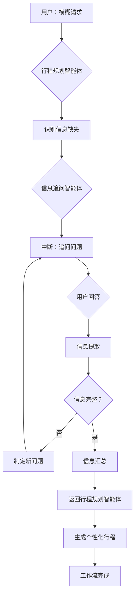

# 人机协同：信息追问模式

本示例演示了一个智能的"人机协同"模式：**信息追问**。它展示了一个多智能体工作流，其中一个智能体（行程规划师）识别信息缺失，并委托另一个专门的信息追问智能体来主动、迭代地向用户收集必要信息，最终完成复杂任务。

## 工作原理

此实现使用**嵌套智能体架构**，两个专业智能体协同工作：

1. **行程规划智能体**：一个专门生成旅行行程的智能体。当它发现用户请求信息不足时（例如，只知道目的地但不知道兴趣偏好），它会调用信息追问智能体。

2. **信息追问智能体**：一个专门负责信息收集的智能体。它：
   - 使用 `FollowUpTool` 中断执行并向用户提问
   - 分析用户的回答，提取所需信息
   - 如果信息不完整，会制定新的问题继续追问
   - 在达到退出条件时（信息完整、用户拒绝、达到最大尝试次数）返回信息摘要

### 工作流序列

1. **初始请求**：用户提出模糊请求（例如，"为纽约市规划一个3天的行程"）
2. **信息识别**：行程规划智能体识别信息缺失，调用信息追问智能体
3. **追问中断**：信息追问智能体触发中断，向用户呈现格式化的问题列表
4. **用户回答**：用户提供自然语言回答
5. **信息提取与迭代**：信息追问智能体：
   - 从回答中提取所需信息
   - 如果信息不完整，制定新的针对性问题
   - 重复追问过程（最多10次尝试）
6. **信息汇总**：当信息足够或达到退出条件时，返回信息摘要
7. **任务完成**：行程规划智能体基于收集的信息生成个性化行程

## 展示的关键特性

- **智能信息识别**：智能体能够识别何时需要更多信息
- **迭代追问**：支持多轮对话，基于用户回答动态调整问题
- **信息提取**：从自然语言回答中提取结构化信息
- **退出条件管理**：优雅处理信息不完整或用户拒绝的情况
- **嵌套智能体协作**：展示智能体如何委托专业任务

## 如何配置环境变量

在运行示例之前，您需要设置 LLM API 所需的环境变量。您有两个选项：

### 选项 1: OpenAI 兼容配置
```bash
export OPENAI_API_KEY="{your api key}"
export OPENAI_BASE_URL="{your model base url}"
# 仅在使用 Azure 类 LLM 提供商时配置此项
export OPENAI_BY_AZURE=true
# 'gpt-4o' 只是一个示例，请配置您的 LLM 提供商提供的实际模型名称
export OPENAI_MODEL="gpt-4o-2024-05-13"
```

### 选项 2: ARK 配置
```bash
export MODEL_TYPE="ark"
export ARK_API_KEY="{your ark api key}"
export ARK_MODEL="{your ark model name}"
```

或者，您可以在项目根目录创建一个 `.env` 文件来设置这些变量。

## 如何运行

确保您已设置好环境变量（例如，LLM API 密钥）。然后，在 `eino-examples` 仓库的根目录下运行以下命令：

```sh
go run ./adk/human-in-the-loop/4_follow-up
```

您将看到：
1. 行程规划智能体识别信息需求
2. 信息追问智能体开始提问
3. 与智能体进行多轮对话
4. 最终获得基于您偏好的个性化行程

## 工作流程图



## 实际示例

以下是运行示例的实际跟踪记录，展示了迭代追问过程的工作原理：

```
name: ItineraryAgent 
path: [{ItineraryAgent}] 
tool name: FollowUpAgent 
arguments: {"request":"What are your interests or preferences for this 3-day trip to New York City? For example, do you like museums, theater, shopping, food experiences, outdoor activities, historical sites, or anything else specific?"} 

name: ItineraryAgent 
path: [{ItineraryAgent}] 
We need more information. Please answer the following questions: 
1. What are your interests or preferences for the 3-day trip to New York City? 
2. Do you prefer museums, theater, shopping, food experiences, outdoor activities, or historical sites? 
3. Are there any specific places or activities you want to include in your trip? 

Your answer: My main interest are family friendly theme parks. We prefer theaters at night. I don't have any particular places or activities in mind. 

name: ItineraryAgent 
path: [{ItineraryAgent}] 
We need more information. Please answer the following questions: 
1. Are you interested in visiting any of the well-known theme parks near New York City, such as Six Flags Great Adventure or Coney Island? 
2. What type of theater shows do you prefer at night? (e.g., musicals, Broadway shows, plays, comedy) 
3. Do you want recommendations for family-friendly restaurants or dining experiences? 

Your answer: I have no prior knowledge or New York City's theme parks, so help me decide. We prefer musicals. Chinese food will suffice. 

name: ItineraryAgent 
path: [{ItineraryAgent}] 
tool response: You are interested in family-friendly theme parks but do not have prior knowledge of the options near New York City. You prefer theatrical musicals for evening shows and are open to Chinese food for dining experiences. You don't have specific places or activities in mind and are seeking help to decide on theme parks to visit. 

name: ItineraryAgent 
path: [{ItineraryAgent}] 
answer: Here's a suggested 3-day itinerary for your family-friendly trip to New York City, including theme parks, theatrical musicals, and Chinese dining experiences: 

Day 1: 
- Morning: Visit Luna Park at Coney Island, a classic family-friendly amusement park with rides and games. 
- Lunch: Enjoy a casual meal at one of the park's eateries. 
- Afternoon: Explore the Coney Island Boardwalk and beach area. 
- Evening: Dinner at a Chinese restaurant in Manhattan's Chinatown, experiencing authentic flavors. 
- Night: Attend a theatrical musical on Broadway, suitable for families. 

Day 2: 
- Morning: Head to the Bronx Zoo, a large and renowned zoo with interactive exhibits for children. 
- Lunch: Picnic or dine at the zoo café. 
- Afternoon: Visit the New York Botanical Garden nearby for a relaxing walk. 
- Evening: Dinner at another top-rated Chinese restaurant, possibly in Flushing, Queens (known for excellent Chinese cuisine). 
- Night: Consider a Broadway or off-Broadway musical that caters to family audiences. 

Day 3: 
- Morning: Explore the American Museum of Natural History, which is engaging for all ages. 
- Lunch: Eat at a family-friendly restaurant on the Upper West Side. 
- Afternoon: Walk or bike through Central Park, visit playgrounds, or enjoy a boat ride on the lake. 
- Evening: Final dinner at a Chinese restaurant specializing in dim sum or regional specialties. 
- Night: Optional second musical or relaxation depending on the family's energy. 

If you want me to customize this further with specific shows, restaurants, or travel tips, please let me know! 
```

此跟踪记录展示了：
- **初始信息识别**：行程规划智能体识别需要更多用户偏好信息
- **迭代追问**：信息追问智能体进行两轮提问，逐步细化用户需求
- **智能信息提取**：从用户回答中提取关键信息（家庭友好主题公园、音乐剧、中餐）
- **个性化结果**：基于收集的信息生成高度个性化的行程

路径表示法显示了智能体如何通过工具调用和中断机制进行协作。

## 实现细节

### 智能体架构
- **ItineraryAgent**：使用 `adk.NewChatModelAgent` 创建的行程规划智能体
- **FollowUpAgent**：专门的信息追问智能体，通过 `adk.NewAgentTool` 包装为工具
- **嵌套调用**：行程规划智能体将信息收集任务委托给专业的信息追问智能体

### 工具集成
- **FollowUpTool**：位于 `adk/common/tool/follow_up_tool.go` 的自定义工具
- **格式化提问**：工具提供清晰、编号的问题列表，优化用户体验
- **状态管理**：使用 `StatefulInterrupt` 维护追问会话状态

### 退出条件管理
- **最大尝试次数**：限制为10次追问尝试，避免无限循环
- **用户拒绝处理**：识别"我不知道"或"我拒绝回答"等退出信号
- **信息完整性检查**：智能判断何时信息足够完成任务

## 使用场景

此模式适用于：
- 需要用户输入的复杂任务规划
- 信息收集和需求分析工作流
- 客户服务和咨询场景
- 任何需要迭代澄清和细化用户需求的场景

该实现展示了如何使用 Eino 框架构建智能的、自适应的对话系统，能够主动识别信息需求并通过多轮对话收集必要信息。