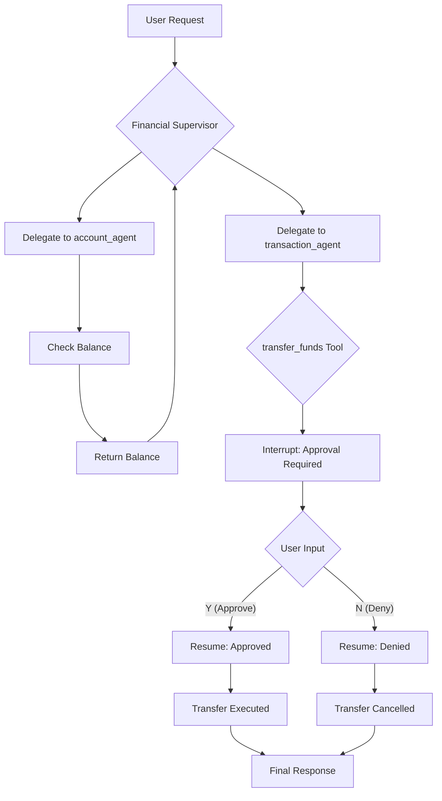

# Human-in-the-Loop: Supervisor Pattern with Approval

This example demonstrates the **Supervisor** multi-agent pattern combined with the **Approval** human-in-the-loop pattern.

It showcases how to build a hierarchical multi-agent system where a supervisor coordinates specialized sub-agents, and sensitive operations (like fund transfers) require explicit user approval before execution.

## How It Works

1. **Supervisor Architecture**: A financial advisor supervisor manages two specialized sub-agents:
   - **account_agent**: Handles account-related queries like checking balances
   - **transaction_agent**: Handles financial transactions like fund transfers

2. **Approvable Tool**: The `transaction_agent` has a `transfer_funds` tool wrapped in `InvokableApprovableTool`. This ensures that before any fund transfer is executed, the user must explicitly approve it.

3. **Workflow**:
   - User requests an action (e.g., "Check balance and transfer $500")
   - Supervisor delegates to `account_agent` for balance check
   - Supervisor delegates to `transaction_agent` for the transfer
   - When `transfer_funds` is called, an **interrupt** is triggered
   - User approves or denies the transaction
   - Agent resumes and completes (or cancels) the operation

4. **Targeted Resume**: After user input, `runner.ResumeWithParams` is called with the approval result, allowing the agent to continue execution.

## Practical Example

Here's what the approval flow looks like:

```
========================================
User Query: Check my checking account balance, and then transfer $500 from checking to savings account.
========================================

name: financial_supervisor
path: [{financial_supervisor}]
action: transfer to account_agent

name: account_agent
path: [{financial_supervisor} {account_agent}]
tool name: check_balance
arguments: {"account_id":"checking"}

name: account_agent
path: [{financial_supervisor} {account_agent}]
tool response: {"account_id":"checking","balance":5000,"currency":"USD"}

name: financial_supervisor
path: [{financial_supervisor}]
action: transfer to transaction_agent

name: transaction_agent
path: [{financial_supervisor} {transaction_agent}]
tool name: transfer_funds
arguments: {"from_account":"checking","to_account":"savings","amount":500,"currency":"USD"}

========================================
APPROVAL REQUIRED
========================================
tool 'transfer_funds' interrupted with arguments '{"from_account":"checking","to_account":"savings","amount":500,"currency":"USD"}', waiting for your approval, please answer with Y/N

Approve this transaction? (Y/N): Y

========================================
Resuming execution...
========================================

name: transaction_agent
path: [{financial_supervisor} {transaction_agent}]
tool response: {"transaction_id":"TXN-2025-001234","status":"completed",...}
```

This trace demonstrates:
- **Hierarchical Delegation**: Supervisor routes tasks to appropriate sub-agents
- **Balance Check**: Account agent retrieves balance without approval
- **Approval Required**: Transfer operation triggers an interrupt for user confirmation
- **Targeted Resume**: After approval, the transaction completes

## How to Configure Environment Variables

Before running the example, you need to set up the required environment variables for the LLM API. You have two options:

### Option 1: OpenAI-Compatible Configuration
```bash
export OPENAI_API_KEY="{your api key}"
export OPENAI_BASE_URL="{your model base url}"
# Only configure this if you are using Azure-like LLM providers
export OPENAI_BY_AZURE=true
# 'gpt-4o' is just an example, configure the model name provided by your LLM provider
export OPENAI_MODEL="gpt-4o-2024-05-13"
```

### Option 2: ARK Configuration
```bash
export MODEL_TYPE="ark"
export ARK_API_KEY="{your ark api key}"
export ARK_MODEL="{your ark model name}"
```

Alternatively, you can create a `.env` file in the project root with these variables.

## How to Run

Ensure you have your environment variables set (e.g., for the LLM API key). Then, run the following command from the root of the `eino-examples` repository:

```sh
go run ./adk/human-in-the-loop/5_supervisor
```

You will see the supervisor coordinating between agents, and when a fund transfer is attempted, you'll be prompted to approve or deny the transaction.

## Workflow Diagram


