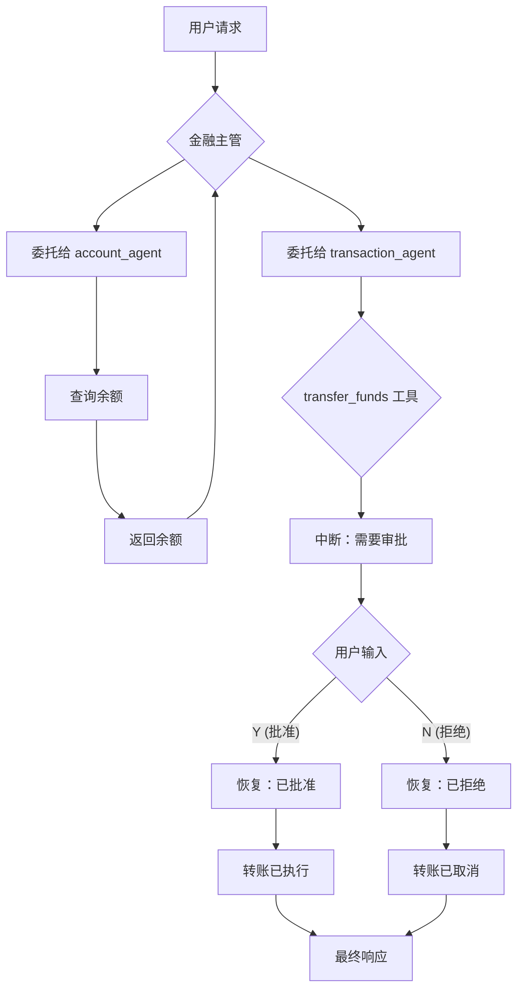

# 人机协同：Supervisor 模式与审批

本示例演示了 **Supervisor** 多智能体模式与 **审批** 人机协同模式的结合。

它展示了如何构建一个层级化的多智能体系统，其中主管智能体协调专业化的子智能体，而敏感操作（如资金转账）在执行前需要用户的明确批准。

## 工作原理

1. **Supervisor 架构**：一个金融顾问主管管理两个专业化的子智能体：
   - **account_agent**：处理账户相关查询，如查询余额
   - **transaction_agent**：处理金融交易，如资金转账

2. **可审批工具**：`transaction_agent` 拥有一个被 `InvokableApprovableTool` 包装的 `transfer_funds` 工具。这确保在执行任何资金转账之前，用户必须明确批准。

3. **工作流程**：
   - 用户发起请求（例如，"查询余额并转账 $500"）
   - 主管将余额查询委托给 `account_agent`
   - 主管将转账操作委托给 `transaction_agent`
   - 当调用 `transfer_funds` 时，触发**中断**
   - 用户批准或拒绝交易
   - 智能体恢复执行并完成（或取消）操作

4. **定向恢复**：用户输入后，调用 `runner.ResumeWithParams` 传递审批结果，允许智能体继续执行。

## 实际示例

以下是审批流程的示例：

```
========================================
User Query: Check my checking account balance, and then transfer $500 from checking to savings account.
========================================

name: financial_supervisor
path: [{financial_supervisor}]
action: transfer to account_agent

name: account_agent
path: [{financial_supervisor} {account_agent}]
tool name: check_balance
arguments: {"account_id":"checking"}

name: account_agent
path: [{financial_supervisor} {account_agent}]
tool response: {"account_id":"checking","balance":5000,"currency":"USD"}

name: financial_supervisor
path: [{financial_supervisor}]
action: transfer to transaction_agent

name: transaction_agent
path: [{financial_supervisor} {transaction_agent}]
tool name: transfer_funds
arguments: {"from_account":"checking","to_account":"savings","amount":500,"currency":"USD"}

========================================
APPROVAL REQUIRED
========================================
tool 'transfer_funds' interrupted with arguments '{"from_account":"checking","to_account":"savings","amount":500,"currency":"USD"}', waiting for your approval, please answer with Y/N

Approve this transaction? (Y/N): Y

========================================
Resuming execution...
========================================

name: transaction_agent
path: [{financial_supervisor} {transaction_agent}]
tool response: {"transaction_id":"TXN-2025-001234","status":"completed",...}
```

此跟踪记录展示了：
- **层级委托**：主管将任务路由到适当的子智能体
- **余额查询**：账户智能体无需审批即可获取余额
- **需要审批**：转账操作触发中断以获取用户确认
- **定向恢复**：批准后，交易完成

## 如何配置环境变量

在运行示例之前，您需要设置 LLM API 所需的环境变量。您有两个选项：

### 选项 1: OpenAI 兼容配置
```bash
export OPENAI_API_KEY="{your api key}"
export OPENAI_BASE_URL="{your model base url}"
# 仅在使用 Azure 类 LLM 提供商时配置此项
export OPENAI_BY_AZURE=true
# 'gpt-4o' 只是一个示例，请配置您的 LLM 提供商提供的实际模型名称
export OPENAI_MODEL="gpt-4o-2024-05-13"
```

### 选项 2: ARK 配置
```bash
export MODEL_TYPE="ark"
export ARK_API_KEY="{your ark api key}"
export ARK_MODEL="{your ark model name}"
```

或者，您可以在项目根目录创建一个 `.env` 文件来设置这些变量。

## 如何运行

确保您已设置好环境变量（例如，LLM API 密钥）。然后，在 `eino-examples` 仓库的根目录下运行以下命令：

```sh
go run ./adk/human-in-the-loop/5_supervisor
```

您将看到主管在智能体之间进行协调，当尝试进行资金转账时，系统会提示您批准或拒绝交易。

## 工作流程图


