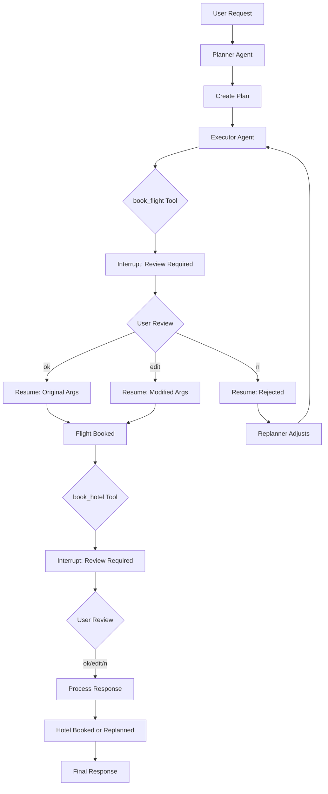

# Human-in-the-Loop: Plan-Execute-Replan Pattern with Review-and-Edit

This example demonstrates the **Plan-Execute-Replan** multi-agent pattern combined with the **Review-and-Edit** human-in-the-loop pattern.

It showcases how to build a planning agent system where users can review and modify booking parameters before critical actions (like flight and hotel bookings) are executed.

## How It Works

1. **Plan-Execute-Replan Architecture**: The system consists of three specialized agents:
   - **Planner**: Creates an initial plan based on user requirements
   - **Executor**: Executes each step of the plan using available tools
   - **Replanner**: Adjusts the plan based on execution results

2. **Review-Edit Tools**: The `book_flight` and `book_hotel` tools are wrapped in `InvokableReviewEditTool`. This allows users to:
   - Approve the booking as-is
   - Modify the booking parameters (e.g., change dates, room type)
   - Reject the booking entirely

3. **Workflow**:
   - User requests a travel plan (e.g., "Plan a 3-day trip to Tokyo")
   - Planner creates a multi-step plan
   - Executor attempts to book flights → **interrupt for review**
   - User reviews/edits booking details → resume
   - Executor attempts to book hotel → **interrupt for review**
   - User reviews/edits → resume
   - Plan completes with all bookings confirmed

4. **Iterative Execution**: The plan-execute-replan pattern supports multiple iterations, allowing the replanner to adjust the plan based on execution results or user modifications.

## Practical Example

Here's what the review-and-edit flow looks like:

```
========================================
User Query: Plan a 3-day trip to Tokyo starting from New York on 2025-10-15.
I need to book flights and a hotel. Also recommend some must-see attractions.
========================================

name: Planner
path: [{PlanExecuteAgent} {Planner}]
answer: Creating travel plan...

name: Executor
path: [{PlanExecuteAgent} {Executor}]
tool name: book_flight
arguments: {"from":"New York","to":"Tokyo","date":"2025-10-15","passengers":1,"preferred_time":"morning"}

========================================
REVIEW REQUIRED
========================================
Tool: book_flight
Arguments: {"from":"New York","to":"Tokyo","date":"2025-10-15","passengers":1,"preferred_time":"morning"}
----------------------------------------
Options:
  - Type 'ok' to approve as-is
  - Type 'n' to reject
  - Or enter modified JSON arguments
----------------------------------------
Your choice: ok

========================================
Resuming execution...
========================================

name: Executor
path: [{PlanExecuteAgent} {Executor}]
tool response: {"booking_id":"FL-2025-10-15-12345","airline":"Japan Airlines",...}

name: Executor
path: [{PlanExecuteAgent} {Executor}]
tool name: book_hotel
arguments: {"city":"Tokyo","check_in":"2025-10-15","check_out":"2025-10-18","guests":1,"room_type":"standard"}

========================================
REVIEW REQUIRED
========================================
Tool: book_hotel
Arguments: {"city":"Tokyo","check_in":"2025-10-15","check_out":"2025-10-18","guests":1,"room_type":"standard"}
----------------------------------------
Your choice: {"city":"Tokyo","check_in":"2025-10-15","check_out":"2025-10-18","guests":1,"room_type":"deluxe"}

========================================
Resuming execution...
========================================

name: Executor
path: [{PlanExecuteAgent} {Executor}]
tool response: {"booking_id":"HT-2025-10-15-67890","hotel_name":"Tokyo Grand Hyatt","room_type":"deluxe",...}
```

This trace demonstrates:
- **Planning Phase**: Planner creates a structured travel plan
- **Flight Booking Review**: User approves flight booking as-is
- **Hotel Booking Edit**: User modifies room type from "standard" to "deluxe"
- **Flexible Input**: Users can approve, reject, or provide modified JSON

## How to Configure Environment Variables

Before running the example, you need to set up the required environment variables for the LLM API. You have two options:

### Option 1: OpenAI-Compatible Configuration
```bash
export OPENAI_API_KEY="{your api key}"
export OPENAI_BASE_URL="{your model base url}"
# Only configure this if you are using Azure-like LLM providers
export OPENAI_BY_AZURE=true
# 'gpt-4o' is just an example, configure the model name provided by your LLM provider
export OPENAI_MODEL="gpt-4o-2024-05-13"
```

### Option 2: ARK Configuration
```bash
export MODEL_TYPE="ark"
export ARK_API_KEY="{your ark api key}"
export ARK_MODEL="{your ark model name}"
```

Alternatively, you can create a `.env` file in the project root with these variables.

## How to Run

Ensure you have your environment variables set (e.g., for the LLM API key). Then, run the following command from the root of the `eino-examples` repository:

```sh
go run ./adk/human-in-the-loop/6_plan-execute-replan
```

You will see the planner creating a travel plan, and when bookings are attempted, you'll be prompted to review and optionally edit the booking parameters.

## Workflow Diagram


