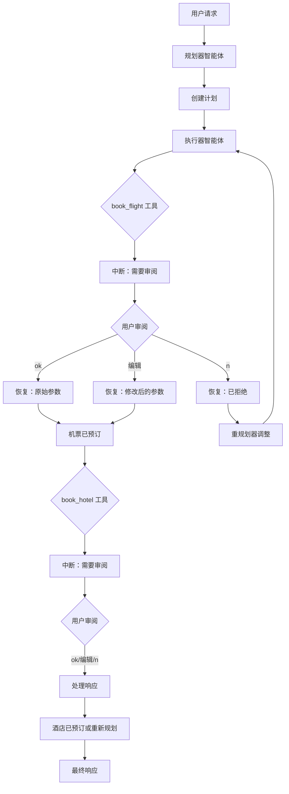

# 人机协同：Plan-Execute-Replan 模式与审阅编辑

本示例演示了 **Plan-Execute-Replan** 多智能体模式与 **审阅编辑** 人机协同模式的结合。

它展示了如何构建一个规划智能体系统，用户可以在关键操作（如机票和酒店预订）执行前审阅并修改预订参数。

## 工作原理

1. **Plan-Execute-Replan 架构**：系统由三个专业化智能体组成：
   - **Planner（规划器）**：根据用户需求创建初始计划
   - **Executor（执行器）**：使用可用工具执行计划的每个步骤
   - **Replanner（重规划器）**：根据执行结果调整计划

2. **审阅编辑工具**：`book_flight` 和 `book_hotel` 工具被 `InvokableReviewEditTool` 包装。这允许用户：
   - 按原样批准预订
   - 修改预订参数（例如，更改日期、房间类型）
   - 完全拒绝预订

3. **工作流程**：
   - 用户请求旅行计划（例如，"规划一次东京3日游"）
   - 规划器创建多步骤计划
   - 执行器尝试预订机票 → **中断以供审阅**
   - 用户审阅/编辑预订详情 → 恢复
   - 执行器尝试预订酒店 → **中断以供审阅**
   - 用户审阅/编辑 → 恢复
   - 计划完成，所有预订已确认

4. **迭代执行**：Plan-Execute-Replan 模式支持多次迭代，允许重规划器根据执行结果或用户修改来调整计划。

## 实际示例

以下是审阅编辑流程的示例：

```
========================================
User Query: Plan a 3-day trip to Tokyo starting from New York on 2025-10-15.
I need to book flights and a hotel. Also recommend some must-see attractions.
========================================

name: Planner
path: [{PlanExecuteAgent} {Planner}]
answer: Creating travel plan...

name: Executor
path: [{PlanExecuteAgent} {Executor}]
tool name: book_flight
arguments: {"from":"New York","to":"Tokyo","date":"2025-10-15","passengers":1,"preferred_time":"morning"}

========================================
REVIEW REQUIRED
========================================
Tool: book_flight
Arguments: {"from":"New York","to":"Tokyo","date":"2025-10-15","passengers":1,"preferred_time":"morning"}
----------------------------------------
Options:
  - Type 'ok' to approve as-is
  - Type 'n' to reject
  - Or enter modified JSON arguments
----------------------------------------
Your choice: ok

========================================
Resuming execution...
========================================

name: Executor
path: [{PlanExecuteAgent} {Executor}]
tool response: {"booking_id":"FL-2025-10-15-12345","airline":"Japan Airlines",...}

name: Executor
path: [{PlanExecuteAgent} {Executor}]
tool name: book_hotel
arguments: {"city":"Tokyo","check_in":"2025-10-15","check_out":"2025-10-18","guests":1,"room_type":"standard"}

========================================
REVIEW REQUIRED
========================================
Tool: book_hotel
Arguments: {"city":"Tokyo","check_in":"2025-10-15","check_out":"2025-10-18","guests":1,"room_type":"standard"}
----------------------------------------
Your choice: {"city":"Tokyo","check_in":"2025-10-15","check_out":"2025-10-18","guests":1,"room_type":"deluxe"}

========================================
Resuming execution...
========================================

name: Executor
path: [{PlanExecuteAgent} {Executor}]
tool response: {"booking_id":"HT-2025-10-15-67890","hotel_name":"Tokyo Grand Hyatt","room_type":"deluxe",...}
```

此跟踪记录展示了：
- **规划阶段**：规划器创建结构化的旅行计划
- **机票预订审阅**：用户按原样批准机票预订
- **酒店预订编辑**：用户将房间类型从 "standard" 修改为 "deluxe"
- **灵活输入**：用户可以批准、拒绝或提供修改后的 JSON

## 如何配置环境变量

在运行示例之前，您需要设置 LLM API 所需的环境变量。您有两个选项：

### 选项 1: OpenAI 兼容配置
```bash
export OPENAI_API_KEY="{your api key}"
export OPENAI_BASE_URL="{your model base url}"
# 仅在使用 Azure 类 LLM 提供商时配置此项
export OPENAI_BY_AZURE=true
# 'gpt-4o' 只是一个示例，请配置您的 LLM 提供商提供的实际模型名称
export OPENAI_MODEL="gpt-4o-2024-05-13"
```

### 选项 2: ARK 配置
```bash
export MODEL_TYPE="ark"
export ARK_API_KEY="{your ark api key}"
export ARK_MODEL="{your ark model name}"
```

或者，您可以在项目根目录创建一个 `.env` 文件来设置这些变量。

## 如何运行

确保您已设置好环境变量（例如，LLM API 密钥）。然后，在 `eino-examples` 仓库的根目录下运行以下命令：

```sh
go run ./adk/human-in-the-loop/6_plan-execute-replan
```

您将看到规划器创建旅行计划，当尝试进行预订时，系统会提示您审阅并可选择编辑预订参数。

## 工作流程图


