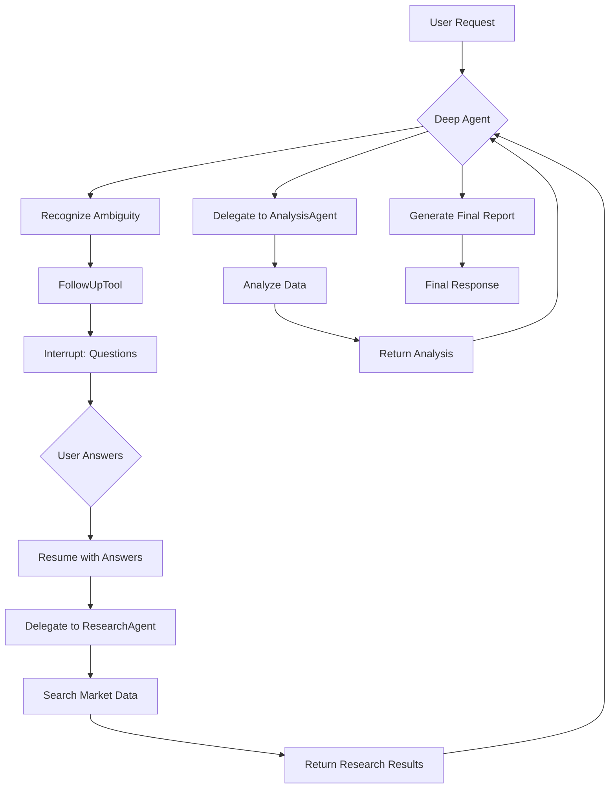

# Human-in-the-Loop: Deep Agents Pattern with Follow-up

This example demonstrates the **Deep Agents** multi-agent pattern combined with the **Follow-up** human-in-the-loop pattern.

It showcases how to build a deep reasoning agent system that proactively asks clarifying questions when user requirements are ambiguous, ensuring accurate and personalized analysis results.

## How It Works

1. **Deep Agent Architecture**: The system uses a deep agent that coordinates specialized sub-agents:
   - **ResearchAgent**: Searches for market, technology, and finance information
   - **AnalysisAgent**: Performs trend, comparison, and statistical analysis
   - **FollowUpTool**: Asks clarifying questions to gather missing information

2. **Follow-up Tool**: The `FollowUpTool` triggers an interrupt to ask the user questions when:
   - The analysis requirements are unclear
   - Specific parameters are needed (time period, sectors, risk tolerance)
   - The agent needs to confirm user preferences

3. **Workflow**:
   - User requests analysis (e.g., "Analyze market trends and provide recommendations")
   - Deep agent recognizes ambiguity → uses `FollowUpTool` → **interrupt**
   - User answers clarifying questions → resume
   - Agent proceeds with research and analysis using clarified requirements
   - Final comprehensive report is generated

4. **Instruction-Driven**: The deep agent is explicitly instructed to use `FollowUpTool` FIRST before any analysis to ensure all necessary information is gathered.

## Practical Example

Here's what the follow-up flow looks like:

```
========================================
User Query: Analyze the market trends and provide investment recommendations.
========================================

name: DataAnalysisAgent
path: [{DataAnalysisAgent}]
tool name: FollowUpTool
arguments: {"questions":["What specific market sectors are you interested in?","What time period should the analysis cover?","What is your risk tolerance?"]}

========================================
CLARIFICATION NEEDED
========================================
The agent needs more information to proceed:

  1. What specific market sectors are you interested in (e.g., technology, finance, healthcare)?
  2. What time period should the analysis cover (e.g., last quarter, year-to-date)?
  3. What type of analysis do you need (e.g., trend, comparison, statistical)?
  4. What is your risk tolerance for investment recommendations (e.g., conservative, moderate, aggressive)?

----------------------------------------
Answer for Q1 (What specific market sectors...): technology and finance
Answer for Q2 (What time period...): last quarter
Answer for Q3 (What type of analysis...): trend analysis
Answer for Q4 (What is your risk tolerance...): moderate

========================================
Resuming with your answers...
========================================

name: DataAnalysisAgent
path: [{DataAnalysisAgent}]
action: transfer to ResearchAgent

name: ResearchAgent
path: [{DataAnalysisAgent} {ResearchAgent}]
tool name: search
arguments: {"query":"technology market trends Q3 2025","category":"technology"}

name: ResearchAgent
path: [{DataAnalysisAgent} {ResearchAgent}]
tool response: {"results":[{"title":"AI Industry Report 2025",...}]}

name: DataAnalysisAgent
path: [{DataAnalysisAgent}]
action: transfer to AnalysisAgent

name: AnalysisAgent
path: [{DataAnalysisAgent} {AnalysisAgent}]
tool name: analyze
arguments: {"data":"...","analysis_type":"trend"}

name: DataAnalysisAgent
path: [{DataAnalysisAgent}]
answer: Based on your preferences for technology and finance sectors with moderate risk tolerance...
```

This trace demonstrates:
- **Proactive Clarification**: Agent asks questions before starting analysis
- **Structured Questions**: Multiple questions gathered in a single interrupt
- **User Answers**: All answers collected and used to guide the analysis
- **Targeted Analysis**: Research and analysis tailored to user's specific requirements

## How to Configure Environment Variables

Before running the example, you need to set up the required environment variables for the LLM API. You have two options:

### Option 1: OpenAI-Compatible Configuration
```bash
export OPENAI_API_KEY="{your api key}"
export OPENAI_BASE_URL="{your model base url}"
# Only configure this if you are using Azure-like LLM providers
export OPENAI_BY_AZURE=true
# 'gpt-4o' is just an example, configure the model name provided by your LLM provider
export OPENAI_MODEL="gpt-4o-2024-05-13"
```

### Option 2: ARK Configuration
```bash
export MODEL_TYPE="ark"
export ARK_API_KEY="{your ark api key}"
export ARK_MODEL="{your ark model name}"
```

Alternatively, you can create a `.env` file in the project root with these variables.

## How to Run

Ensure you have your environment variables set (e.g., for the LLM API key). Then, run the following command from the root of the `eino-examples` repository:

```sh
go run ./adk/human-in-the-loop/7_deep-agents
```

You will see the deep agent asking clarifying questions about your analysis requirements, and after you provide answers, it will proceed with a tailored market analysis.

## Workflow Diagram



## Key Differences from Other Patterns

| Aspect | Approval | Review-Edit | Follow-up |
|--------|----------|-------------|-----------|
| **Trigger** | Sensitive action | Booking/modification | Ambiguous requirements |
| **User Action** | Yes/No | Approve/Edit/Reject | Answer questions |
| **Purpose** | Authorization | Parameter validation | Information gathering |
| **Timing** | Before execution | Before execution | Before planning |
