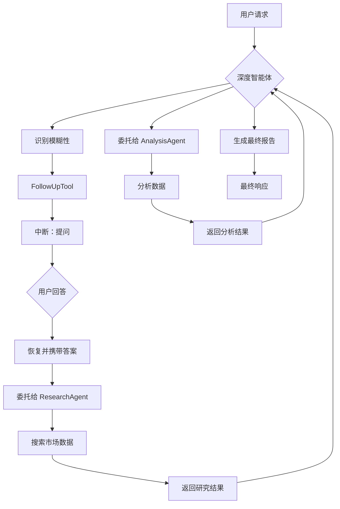

# 人机协同：Deep Agents 模式与追问

本示例演示了 **Deep Agents** 多智能体模式与 **追问** 人机协同模式的结合。

它展示了如何构建一个深度推理智能体系统，当用户需求不明确时主动提出澄清问题，确保分析结果准确且个性化。

## 工作原理

1. **Deep Agent 架构**：系统使用一个深度智能体来协调专业化的子智能体：
   - **ResearchAgent**：搜索市场、技术和金融信息
   - **AnalysisAgent**：执行趋势、对比和统计分析
   - **FollowUpTool**：提出澄清问题以收集缺失信息

2. **追问工具**：`FollowUpTool` 在以下情况触发中断向用户提问：
   - 分析需求不明确
   - 需要特定参数（时间段、行业、风险承受能力）
   - 智能体需要确认用户偏好

3. **工作流程**：
   - 用户请求分析（例如，"分析市场趋势并提供投资建议"）
   - 深度智能体识别模糊性 → 使用 `FollowUpTool` → **中断**
   - 用户回答澄清问题 → 恢复
   - 智能体使用明确的需求进行研究和分析
   - 生成最终综合报告

4. **指令驱动**：深度智能体被明确指示在任何分析之前首先使用 `FollowUpTool`，以确保收集所有必要信息。

## 实际示例

以下是追问流程的示例：

```
========================================
User Query: Analyze the market trends and provide investment recommendations.
========================================

name: DataAnalysisAgent
path: [{DataAnalysisAgent}]
tool name: FollowUpTool
arguments: {"questions":["What specific market sectors are you interested in?","What time period should the analysis cover?","What is your risk tolerance?"]}

========================================
CLARIFICATION NEEDED
========================================
The agent needs more information to proceed:

  1. What specific market sectors are you interested in (e.g., technology, finance, healthcare)?
  2. What time period should the analysis cover (e.g., last quarter, year-to-date)?
  3. What type of analysis do you need (e.g., trend, comparison, statistical)?
  4. What is your risk tolerance for investment recommendations (e.g., conservative, moderate, aggressive)?

----------------------------------------
Answer for Q1 (What specific market sectors...): technology and finance
Answer for Q2 (What time period...): last quarter
Answer for Q3 (What type of analysis...): trend analysis
Answer for Q4 (What is your risk tolerance...): moderate

========================================
Resuming with your answers...
========================================

name: DataAnalysisAgent
path: [{DataAnalysisAgent}]
action: transfer to ResearchAgent

name: ResearchAgent
path: [{DataAnalysisAgent} {ResearchAgent}]
tool name: search
arguments: {"query":"technology market trends Q3 2025","category":"technology"}

name: ResearchAgent
path: [{DataAnalysisAgent} {ResearchAgent}]
tool response: {"results":[{"title":"AI Industry Report 2025",...}]}

name: DataAnalysisAgent
path: [{DataAnalysisAgent}]
action: transfer to AnalysisAgent

name: AnalysisAgent
path: [{DataAnalysisAgent} {AnalysisAgent}]
tool name: analyze
arguments: {"data":"...","analysis_type":"trend"}

name: DataAnalysisAgent
path: [{DataAnalysisAgent}]
answer: Based on your preferences for technology and finance sectors with moderate risk tolerance...
```

此跟踪记录展示了：
- **主动澄清**：智能体在开始分析前提出问题
- **结构化问题**：在单次中断中收集多个问题
- **用户回答**：收集所有答案并用于指导分析
- **定向分析**：研究和分析根据用户的具体需求进行定制

## 如何配置环境变量

在运行示例之前，您需要设置 LLM API 所需的环境变量。您有两个选项：

### 选项 1: OpenAI 兼容配置
```bash
export OPENAI_API_KEY="{your api key}"
export OPENAI_BASE_URL="{your model base url}"
# 仅在使用 Azure 类 LLM 提供商时配置此项
export OPENAI_BY_AZURE=true
# 'gpt-4o' 只是一个示例，请配置您的 LLM 提供商提供的实际模型名称
export OPENAI_MODEL="gpt-4o-2024-05-13"
```

### 选项 2: ARK 配置
```bash
export MODEL_TYPE="ark"
export ARK_API_KEY="{your ark api key}"
export ARK_MODEL="{your ark model name}"
```

或者，您可以在项目根目录创建一个 `.env` 文件来设置这些变量。

## 如何运行

确保您已设置好环境变量（例如，LLM API 密钥）。然后，在 `eino-examples` 仓库的根目录下运行以下命令：

```sh
go run ./adk/human-in-the-loop/7_deep-agents
```

您将看到深度智能体询问关于您分析需求的澄清问题，在您提供答案后，它将进行定制化的市场分析。

## 工作流程图



## 与其他模式的主要区别

| 方面 | 审批 | 审阅编辑 | 追问 |
|------|------|----------|------|
| **触发条件** | 敏感操作 | 预订/修改 | 模糊需求 |
| **用户操作** | 是/否 | 批准/编辑/拒绝 | 回答问题 |
| **目的** | 授权 | 参数验证 | 信息收集 |
| **时机** | 执行前 | 执行前 | 规划前 |
