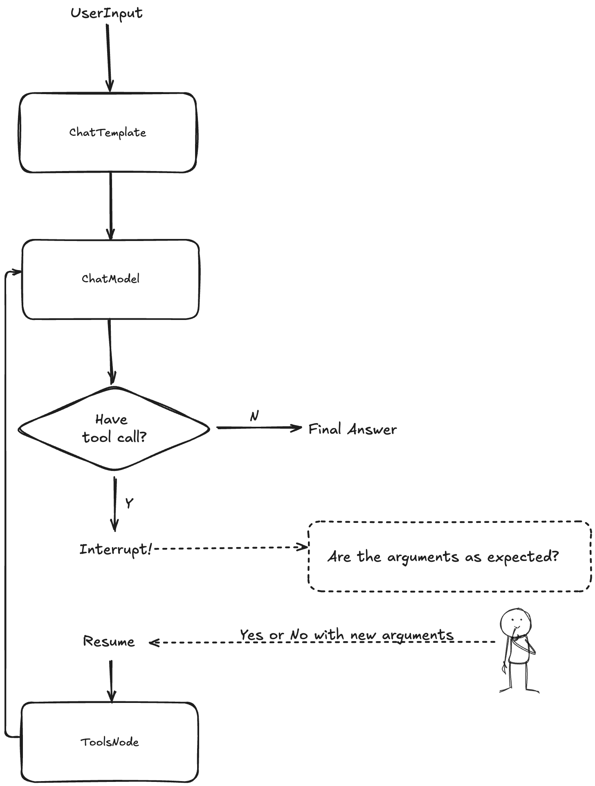

This example assumes a ticket booking scenario to demonstrate Eino interrupt and checkpoint practices: The agent receives the user's input such as name and destination, then calls the booking tool to assist the user in booking tickets. Before the tool executes, users can confirm if the information is correct. If it is incorrect, they can modify or complete the information, and then resume the agent's operation.



The trace of a single call is as follows:
```
will call tool: BookTicket, arguments: {"location":"Beijing","passenger_name":"Megumin","passenger_phone_number":""}
Are the arguments as expected? (y/n): n
Please enter the modified arguments: {"location":"Beijing","passenger_name":"Megumin","passenger_phone_number":"1234567890"}
Updated arguments to: {"location":"Beijing","passenger_name":"Megumin","passenger_phone_number":"1234567890"}
final result: Your ticket to Beijing has been successfully booked, Megumin! Safe travels!
```
